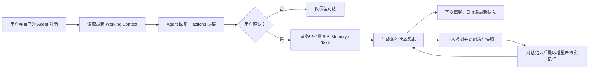

# Agent Memory 系统实现

## 1. 实现目标

本次改造把原来“每个资料保存一块 JSON”的记忆，升级为每个 Agent 独立的结构化工作状态。现在可以：

- 按 Agent 增、查、改、归档和恢复 Memory。
- 按 Agent 创建和维护任务，支持待办、进行中、阻塞、完成和取消状态。
- 用户在与自己的 Agent 对话时，让 Agent 提出 Memory / 任务变更；用户确认后才原子执行。
- 下一次用户对话、日报或模拟自动读取最新的已确认决策、任务和相关记忆。
- 每次模拟仍保留快照语义：运行中不会被后来的记忆修改。

完整实现为本项目内置的轻量系统，没有引入 Mem0。原因是这个 Demo 的核心不是大规模语义召回，而是“用户确认的决策如何可控地进入任务层”。自建版本更容易演示确认门、快照、任务状态、冲突检测和完整调试链路。

## 2. 用户可见功能

### 2.1 Memory 与任务面板

每个 Agent 配置区新增“Memory 与任务状态”模块：

- Memory 可按关键字搜索，可切换是否显示已归档项。
- Memory 类型包括 `fact`、`preference`、`decision`、`constraint`、`note`。
- 核实状态包括 `confirmed`、`unverified`、`conflicted`。
- 可新增、编辑、确认、归档或恢复 Memory。
- 任务可新增、开始、完成、取消或重新打开。

删除采用软删除/归档，不会直接物理清除记录。这样既满足 Demo 中的“删”，又能保留可追溯性。

### 2.2 用户指挥 Agent

用户直聊的模型输出现在除了 `message` 和 `control`，还可包含 `actions`：

```json
{
  "message": "好的，我建议把这项决策记下来，并创建一个跟进任务。",
  "control": {
    "suggest_end": false,
    "end_reason": null,
    "information_sufficient": true
  },
  "actions": [
    {
      "id": "remember-demo-decision",
      "type": "memory.create",
      "reason": "用户明确表示本周安排 Demo",
      "input": {
        "kind": "decision",
        "title": "本周安排产品 Demo",
        "content": "在本周五前安排一次产品 Demo",
        "priority": 90
      }
    },
    {
      "id": "create-demo-task",
      "type": "task.create",
      "reason": "需要可执行的下一步",
      "input": {
        "title": "确认产品 Demo 时间",
        "description": "联系对方确认本周五前的具体时间",
        "priority": 80
      }
    }
  ]
}
```

界面会展示变更类型、理由和输入，用户可选择“确认执行”或“不执行”。未确认的提议不会写库；一批行动中任何一个失败时，整批回滚。执行失败后可重试。

这是“给 Agent 工具”的可控实现：Agent 获得的是结构化行动协议，而不是直接写 SQLite 的权限。目前没有把写操作做成模型可直接调用的 function tool，因为用户确认是必要的产品语义。以后可以把同一批 API 包装成只读查询工具和需审批的写入工具。

## 3. 运行链路



不同入口对状态时效性的处理如下：

| 入口 | 记忆读取时机 | 目的 |
| --- | --- | --- |
| 用户直聊 | 每次发送消息前重新读取 | 上一轮刚确认的决策在下一轮立即生效 |
| 日报 | 每次生成前读取 | 使日报反映当前最新任务和决策 |
| 双 Agent 模拟 | 点击开始时读取并冻结 | 保证对话可重现，运行中不漂移 |
| 会后记忆提取 | 使用本次运行冻结状态作为去重参考 | 只输出本轮增量，不覆盖整份记忆 |
| 按原快照重跑 | 使用原记忆/任务快照 | 完全保持原运行条件 |

## 4. 数据模型与隔离

存储层使用项目已有的 SQLite 数据文件，新增四张表：

### `agent_memories`

关键字段：

- `scope_id + agent_id`：记忆的基本隔离边界。
- `kind`：事实、偏好、决策、约束或备注。
- `verification`：已确认、未核实或存在冲突。
- `status`：有效、已被替代、已归档或已删除。
- `counterparty_id`：可选的对手方作用域；空值表示 Agent 全局记忆。
- `source_type + source_id`：来源标识和幂等键，防止同一次模拟或对话重复写入。
- `version`：乐观锁版本。

### `agent_tasks`

任务包含标题、说明、状态、优先级、截止时间、对手方、关联 Memory、来源和版本。工作上下文只注入 `todo`、`in_progress`、`blocked` 三种活动状态。

### `agent_state_events`

每次 Memory / 任务变更保存变更前、变更后、来源和时间。当前只实现了存储层审计，还没有审计日志查看页。

### `agent_action_batches`

保存已成功提交的直聊行动批次与返回结果。同一 `scope_id + agent_id + source_type + source_id` 被重试时直接返回首次结果，不会再次修改版本或重复创建数据。

`scope_id` 由浏览器首次打开时生成，存在 `localStorage` 中，并通过 `x-agent-memory-scope` 请求头发送给服务端。它可以防止同一服务上不同浏览器 Demo 状态互相污染，但不是正式的用户/租户认证。清空浏览器存储后会生成新作用域；原数据仍在 SQLite 中，但当前 UI 不会自动恢复旧作用域。

## 5. Working Context 投影

服务端会把结构化数据编译成 `WorkingContextSnapshot`：

- 已确认的 `decision / preference / constraint` 放在“已确认决策与偏好”区。
- 活动任务放在“当前任务”区。
- 事实、历史和未核实内容放在参考区，并明确禁止将其当成用户指令。
- 只选择 Agent 全局项和当前对手方项。
- 每份快照包含内容哈希版本、生成时间、结构化原数据和提示词文本。
- 提示词投影最多 18,000 字符，超过时保留已按优先级排序的前部内容。

这份上下文由平台生成并追加到任务层。即使普通任务层被关闭，受控的工作状态仍可注入；它不能覆盖平台层、身份边界、工具权限和安全规则。

## 6. 记忆写入规则

### 用户确认的行动

直聊中经用户点击确认的 Memory 会写为 `confirmed`。更新和归档必须携带当前 ID 和 `expectedVersion`；如果期间另一个操作已修改该条目，API 返回 `409`，避免旧快照覆盖新决策。

### 模拟后自动提取

模拟结束后，记忆提取器只能输出增量的 `fact / preference / constraint / note`，最多 12 条。程序会将它们强制标为 `unverified`；模型即使输出 `confirmed` 也不会自动升级。信息冲突时可保留 `conflicted`。

自动提取不能生成 `decision`。用户决策必须通过手动编辑或直聊确认门进入，避免 Agent 把自己的建议写成用户已决定的事。

### 旧数据迁移

如果当前资料还有旧版整块 JSON 记忆，首次加载时会幂等地导入为一条低优先级、未核实的 `note`。原值仍保留用于查看历史模拟结果，不再作为新运行的主记忆源。

## 7. API

所有路由都需要登录。写请求另外校验同源，并且所有请求都需要有效的 `x-agent-memory-scope`。Agent ID 必须存在于服务端已保存的资料库中。

| 方法 | 路由 | 用途 |
| --- | --- | --- |
| `GET` | `/api/memories` | 按 Agent、状态、类型、对手方和关键字查询 |
| `POST` | `/api/memories` | 创建 Memory |
| `GET` | `/api/memories/:id` | 读取单条 Memory |
| `PATCH` | `/api/memories/:id` | 更新、确认或恢复 Memory |
| `DELETE` | `/api/memories/:id` | 归档 Memory |
| `GET` | `/api/tasks` | 查询 Agent 任务 |
| `POST` | `/api/tasks` | 创建任务 |
| `PATCH` | `/api/tasks/:id` | 更新任务 |
| `DELETE` | `/api/tasks/:id` | 取消任务 |
| `POST` | `/api/agent-actions` | 原子执行用户确认的行动批次 |
| `GET` | `/api/agent-context` | 编译当前 Agent 的 Working Context |

## 8. 主要代码位置

- `lib/memory-store.ts`：SQLite 表、CRUD、幂等、乐观锁、审计事件和行动事务。
- `lib/memory-context.ts`：按 Agent / 对手方筛选并生成 Working Context。
- `lib/agent-state-api.ts`：作用域、Agent 校验和 API 通用逻辑。
- `app/api/memories/`、`app/api/tasks/`：Memory 与任务 API。
- `app/api/agent-actions/`：确认后的批量行动 API。
- `app/api/agent-context/`：工作上下文 API。
- `lib/defaults.ts`：上下文注入、直聊行动协议、增量记忆和日报提示词组合。
- `app/DemoApp.tsx`：面板 UI、调用编排、确认门、模拟快照、日报和旧数据迁移。
- `tests/memory-store.test.ts`：CRUD、幂等、版本冲突、上下文投影和批量回滚测试。

## 9. 运行与验证

```bash
npm run test:memory
npm run test
```

`test:memory` 使用临时目录中的 SQLite，不会改动开发数据。`npm run test` 会依次执行 ESLint、Memory 测试和 Next.js 生产构建。

## 10. 当前边界与后续方向

当前版本是适合 Demo 验证的基础版，有以下明确边界：

- 查询使用 SQLite 关键字搜索和确定性规则，暂无 embedding / 语义检索。Memory 规模增长后可增加向量召回，也可在届时接入 Mem0，但仍建议保留本次的确认门与任务表。
- 没有后台自动计划器。已确认决策和任务会影响下一次 Agent 行为，但不会自己定时调用邮件、日历或其他外部系统。
- 审计事件已入库，尚无查看和回滚 UI。
- `scope_id` 是 Demo 级浏览器作用域，不替代正式多用户认证、租户隔离、加密、留存和导出/删除策略。
- Working Context 为了可调试会包含完整结构化项，项目扩大后应加入 token 预算、摘要、时效衰减和更细的召回排序。
